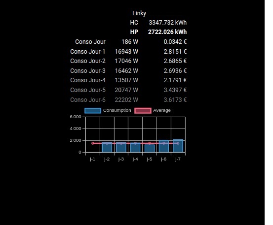

# Module: MMM-D2L
The module allows you to fetch data from Linky D2L module, see https://d2l.sicame.io/ for more information.

## UI


## Installation

In your terminal, go to your MagicMirror's Module folder:
````
cd ~/MagicMirror/modules
````

Clone this repository:
````
git clone https://github.com/berryerlouis/MMM-D2L.git
````

Install the module dependencies:
````
cd MMM-D2L
npm install
````

Configure the module in your `config.js` file.

**Note:** After starting the Mirror, it will take a few seconds before the chart and data start to appear.

## Using the module

To use this module, add it to the modules array in the `config/config.js` file:
````javascript
modules: [
  {
    module: "MMM-D2L",
    position: "right",
    config: { // See "Configuration options" for more information.
      login: "",
      password: "",
      contract:6000,
      updateInterval: 60 * 60 * 1000 
      showCompteurId: true,
      heuresCreuses:[
        {
          start:1,
          end:7
        },
        {
          start:11,
          end:13
        },
      ],
		  price: 
      { 
        hc: 0.1470, 
        hp: 0.1841 
      },
      currency: '€',
    }
  }
]
````

## Configuration options

The following properties can be configured:

|Option|Default|Description|
|---|---|---|
|`login`|`""`|Set the login from https://d2l.sicame.io/.|
|`password`|`""`|Set the password from https://d2l.sicame.io/.|
|`contract`|`6000`|Set the max Watt contract subscribed.|
|`showCompteurId`|`false`|Show 'Compteur Id'.|
|`updateInterval`|`60 * 60 * 1000`|How often (in ms) to fetch data.|
|`heuresCreuses`|`[{start:1,end:7},{start:11,end:13}]`|set the hours of each 'heures creuses' from start to end.|
|`price`|`{ hc: 0.1470, hp: 0.1841 }`|Set the price of each 'heures creuses' and 'heures pleines'.|
|`showChart`|`true`|Set the Chart of the 7 lastest days consumption.|
|`currency`|`€`|Set the 'currency'.|

## Notifications

MMM-D2L can react to the following notifications sent by other modules:

|Notification|Payload|Description|
|---|---|---|
|`UPDATE_D2L`|`none`|Will update the data from d2l.|